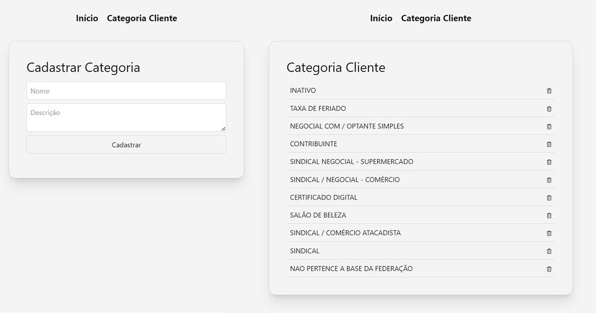

# consulta-cliente

> Simple app to consume an OData API and perform Create, Read, and Delete actions. Built using React with TypeScript and Vite as package manager. Styled with Tailwind CSS. Deployed to production via Vercel.

##

### Technologies used

 
  
  
  
  
  
  

 

##

Live link: https://consulta-cliente.vercel.app/
